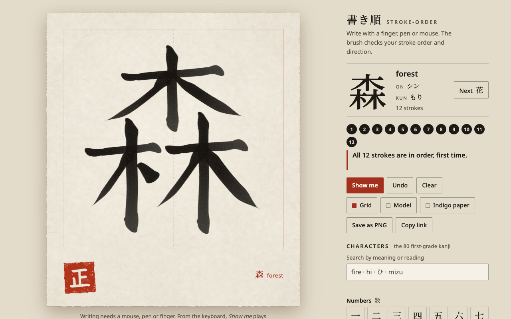

# stroke-order 書き順

Write a kanji with your finger or mouse. Ink appears as a brush, and the page checks
your stroke order and direction, stroke by stroke.



## The 30-second experience

1. Pick a character. The set is the 80 kanji Japanese children learn in their first
   year of school, grouped as numbers, nature, people and everyday. Search by meaning
   (`fire`), reading in romaji or kana (`hi`, `ひ`, `mizu`), or paste the character.
   Romaji can be Hepburn or Kunrei (`tsuki` or `tuki`), long vowels marked, doubled or
   left out (`jū`, `juu`, `ju`), and full-width or half-width input (`ｍｉｚｕ`, `ｽｲ`)
   is folded first. Readings show okurigana in brackets: おお(きい).
2. Write on the washi sheet. A pale model (usuzumi, "thin ink") sits under the 田
   practice grid; both can be switched off. Each stroke is a flat brush held at an
   angle, so verticals come out broader than horizontals and the ends are cut on a
   slant even at a steady mouse speed. The tip lands at a slant; a sweep tapers to a
   sharp point, a stop presses down at an angle, a hook flicks short. The brush thins
   when you move fast; pen pressure fills it out a little, never into a balloon. The ink
   is wetter where the brush lands and drier towards the end, and only a fast stretch
   (or a flicked sweep's tail) breaks into dry-brush streaks (kasure).
3. After every stroke you get a specific, gentle answer, for example
   *"That's stroke 2 — stroke 1 comes first (the left sweep)."* (右 starts with the
   sweep; 左 starts with the horizontal), *"That's stroke 5 — stroke 3 comes first
   (the vertical down the middle)."* (田), or *"Right stroke, other way round —
   stroke 1 runs left to right."* A rejected stroke fades from the paper.
4. **Show me** writes the character in vermilion teacher's ink, stroke by stroke and
   numbered. With reduced motion turned on, it shows every stroke at once, numbered,
   with an arrowhead for its direction.
5. Write it correctly and a vermilion seal reading 正 ("correct") stamps the sheet.
   **Save as PNG** downloads your sheet; **Copy link** copies a link to the character
   (`#k=%E7%81%AB` for 火).

Controls fade while the brush is on the paper and come back when you lift it. The
sheet comes in washi (sumi ink on off-white) or indigo (light ink on dark indigo
paper); it follows the system theme until you choose.

## How it works

Everything that decides anything is Kotlin in `src/commonMain`: plain Kotlin with no
browser APIs, so the same code could compile for Android or iOS through Kotlin
Multiplatform. I have not built those apps; the repository only builds the web app,
plus a JVM target that runs the same tests a second time on a different platform.

- **Path parsing** (`engine/SvgPath.kt`): KanjiVG's SVG path data (`M`, `C`, `S`…,
  absolute and relative, packed numbers like `0.62-5.12`) becomes polylines in the
  109 × 109 KanjiVG frame.
- **Resampling** (`engine/Geometry.kt`): every stroke is resampled to 32 points evenly
  spaced along its length, so a slow stroke and a fast one compare fairly.
- **Comparison** (`engine/StrokeMatcher.kt`): a drawn stroke is compared with each
  reference stroke, forwards and backwards, on three measures:
  - *position*: the mean distance between matching points. This is what tells apart
    the three look-alike horizontals of 三. For a dot or other short mark (a dab of the
    brush), position is where the dab lands, so a dab much shorter than KanjiVG's drawn
    dot still counts;
  - *shape*: a discrete Fréchet distance after both strokes are centred and scaled.
    Like $P, it ignores where and how big; unlike $P it respects point order, so a
    corner or a hook matters;
  - *heading*: the mean difference in direction of travel along matching stretches.
    This rejects a V or a zigzag that happens to hover near a horizontal. A short mark
    is held only to a rough overall heading.

  Of two readings (forwards and backwards), one that passes always beats one that
  fails, whatever their overall scores.
- **Order and direction** (`engine/Practice.kt`): a small state machine (sealed
  classes for verdicts, stroke states and progress). It asks which reference stroke
  the drawing matches and whether that is the next one. Look-alikes of one kind (三's
  horizontals, 雨's dots) are told apart by position: the nearest wins. For the very
  first stroke, when nothing is written to align to, the expected stroke keeps the
  benefit of the doubt unless the drawing is outside where it would normally be
  accepted and a look-alike is nearer. If the stroke matches only when read
  backwards, it is the right stroke drawn the wrong way. Dots (㇔) are not judged on
  direction: they are too short to read reliably from a finger.
- **Alignment** (`engine/Alignment.kt`): after each accepted stroke, a least-squares
  scale and shift maps your writing onto the model. People rarely write exactly on
  top of the model, so later strokes are judged relative to the ones already written.
  Until your size is known (before the first stroke, or after only a tiny one such as
  字's first tick), strokes far from what is written get proportionally more room.
- **Feedback** (`engine/Feedback.kt`, `engine/Placement.kt`): stroke names come from
  KanjiVG's stroke types (㇐ horizontal, ㇒ left sweep, ㇕ across-and-down turn…), placed
  by where the stroke really is. Every stroke is cut into its straight horizontal and
  vertical stretches, turns included, so 日's third stroke is "the horizontal across
  the middle" (the turn's top counts as a horizontal above it) and 田's third is "the
  vertical down the middle". Other kinds are told apart on both axes ("the upper-left
  dot" of 雨), by length ("the short left sweep") or by order ("the second left sweep"
  of 休), and 宀's hooked top is "the roof". Tests check every description in the
  80-character set is different from the others in its character and never repeats a
  word.
- **Brush** (`ink/BrushModel.kt`): the brush model. The footprint is a flat oval tip
  held at an angle (`Nib`), so the mark's width follows the direction of travel; its
  size follows speed and (capped) pen pressure; it turns to a slant where the tip lands
  and at a stop; a recognised stroke gets the ending its type calls for (sweep, stop or
  hook), anything else ends the way the pen left the paper; and every point carries
  how dry the brush is, from speed and from ink used up along the stroke. The canvas
  painting (footprints stamped into one fill, wet edge, denser core, the wet-to-dry
  gradient, paper grain, broken kasure streaks) is in `src/jsMain/.../Ink.kt`, along
  with the procedural washi, the seal (carved from KanjiVG's own strokes for 正) and the
  rest of the DOM and canvas UI. There is no JavaScript framework; `web/index.html` is
  a static shell.

### Measured matching results

`src/jvmTest/.../FullSetTest.kt` runs the engine over all 80 characters from the
committed KanjiVG snapshot. These are its measured results, on synthetic input:

| check | result |
|---|---|
| every character written from its reference strokes | 80/80 complete |
| "sloppy" writing (84% size, shifted 5 and 4 units, rotated 3°, jitter σ = 1.2 units), 4 seeds | 320/320 complete |
| skipping ahead one stroke, at every step of every character | 320/320 caught as out of order |
| each directional stroke drawn backwards | 367/367 caught |
| the same skip and reverse checks with sloppy writing, 4 seeds | 1279/1280 and 1468/1468 |
| a short dab (3, 5 or 8 units) on every dot and short mark (under 18 units), in place | 126/126 accepted (88/126 before dots were judged as dabs) |

Set `SWEEP_SEEDS=25` to run more seeds. With 25 I measured 2000/2000 sloppy completions,
7999/8000 skip-aheads caught and 9175/9175 reversals caught. The one miss was reported
as "not recognised", not wrongly accepted. These are simulated strokes, not a study of
real handwriting; see the limitations below.

## Why Kotlin

The matching engine is exactly the kind of code that should be written once and used
everywhere: pure geometry and a state machine with no platform in it. Kotlin
Multiplatform keeps that core in `commonMain`, compiles it to JavaScript for this site,
and (tested here) to the JVM, so an Android or iOS app could share it unchanged.
Sealed classes make the verdicts exhaustive: the compiler checks that every kind of
mistake has its own feedback sentence. Kotlin/JS also drives the canvas and the DOM directly, so the
whole app is one language.

**Bundle size (measured on the production build, webpack production mode with Kotlin/JS
dead-code elimination):** `app.js` is 206,059 bytes, 62,588 bytes gzipped (level 9) and
52,221 bytes with Brotli (quality 11); the compressed sizes move by a few dozen bytes
from build to build (see the limitations). That is the Kotlin standard library's share
plus the app. `npm run build` prints these numbers for every file in `dist/`.

## Build and test

Needs **Java 21** and **Node 22+**. On the first run, the Gradle wrapper downloads
Gradle 9.7.1 (and checks it against Gradle's published SHA-256, pinned in
`gradle/wrapper/gradle-wrapper.properties`), the Kotlin 2.4.20 plugin and a Node.js runtime for the Kotlin/JS
toolchain, plus webpack through npm (pinned in `kotlin-js-store/package-lock.json`).
After that, everything comes from Gradle's and npm's local caches. The stroke data
never needs the network: the KanjiVG snapshot is committed.

```sh
npm run build      # verify data checksums, build stroke data, Kotlin/JS production bundle, assemble dist/
npm test           # everything below, in order
npm run test:kotlin   # commonTest on the JVM and on Node (JS), plus the whole-set JVM sweep
npm run test:data     # the data build and WCAG contrast checks
npm run test:e2e      # dist/ smoke, licence notices, headless-Chrome tests
npm run serve         # serve dist/ locally with its real headers (random free port)
```

The browser tests drive headless Chrome over the DevTools protocol, with no npm
dependencies. They write 右 with real mouse events (catching the wrong first stroke and
a backwards sweep, then earning the seal) and write 十 by touch at a true 400 × 860
phone size. They also check hostile share links, Show me (animated, and static under
reduced motion via the keyboard), search, toggles and PNG save, and fail on any
console error. `e2e/errors.test.mjs` checks that a missing data file, a corrupt one and
a failure while starting each get their own honest message. Set `CHROME_PATH` if Chrome is not in a standard place; set
`REQUIRE_BROWSER=1` to make a missing Chrome a failure instead of a skip.

### The data

`data/kanjivg/` is a pinned snapshot: the 80 SVG files and KanjiVG's `COPYING`, from
release **r20260714**, with SHA-256 checksums in `data/kanjivg/SHA256SUMS`. Every build
verifies them without touching the network. `node scripts/fetch-kanjivg.mjs` re-fetches
missing files from that tag and checks them against the same checksums.
`scripts/build-data.mjs` turns the snapshot plus `data/curated.json` (meanings and
readings) into one 54 KB JSON file.

The two web fonts are subsets committed in `web/fonts/`: Noto Serif JP (weight 500,
82 KB, only the characters the app shows) and Noto Sans (Latin, 17 KB).
`scripts/subset_fonts.py` documents how they were made, from pinned source files.

## Licences

- **App code: MIT** (`LICENSE`).
- **Stroke data: CC BY-SA 3.0.** The stroke order, shapes and directions come from
  [KanjiVG](https://kanjivg.tagaini.net) © Ulrich Apel, licensed under
  [CC BY-SA 3.0](https://creativecommons.org/licenses/by-sa/3.0/). Because that licence
  is share-alike, everything under `data/` and the stroke-data file the site loads
  (an adaptation: paths extracted for 80 characters, readings and meanings added) are
  CC BY-SA 3.0 too, kept apart from the MIT code. See `data/LICENSE`. The test
  fixture file `KanjiVgFixtures.kt` holds KanjiVG path data and is CC BY-SA 3.0 as well.
  The page credits KanjiVG in its colophon and links the data file.
- **Fonts: SIL OFL 1.1** (`web/fonts/OFL-*.txt`).
- **`dist/THIRD-PARTY-NOTICES.txt`** (linked from the page) lists everything
  third-party that ships: KanjiVG, the Kotlin standard library (Apache-2.0, with the
  parts it derives from GWT, the Closure Library, Guava, Boost and ThreeTen), the
  webpack runtime (MIT) and both fonts. It includes full licence texts where the
  licence asks for them. A test checks it is there and complete.

## Cloudflare Pages (free tier)

The site is entirely static: 9 files, about 405 KB. It needs no Worker and no storage.
Pages serves static assets with unlimited requests on the free plan, up to 20,000
files per site and 25 MiB per file, so this fits many times over. `dist/_headers`
sets a strict Content-Security-Policy (no third-party anything; the one inline script
is allowed by hash). Long-lived caching applies only to the content-hashed files in
`assets/`; `index.html` is `no-cache`. Progress (which characters you've sealed) and
your paper and grid choices stay in your own browser's localStorage. Nothing is sent
anywhere.

To deploy your own copy: `npm run build`, then
`npx wrangler pages deploy dist --project-name stroke-order`. This repository
deliberately has no deploy script and no `account_id`; the owner deploys through a
separate guarded script so the right account is always used.

## Honest limitations

- **The matching was tuned and measured on synthetic strokes** (reference strokes
  shrunk, shifted, rotated and jittered), not on a corpus of real learners'
  handwriting. Real writing will surface cases the sweep doesn't.
- **Some first strokes are genuinely ambiguous.** Before anything is written there is
  nothing to align to. If you write 天's second horizontal first, but high up where
  the first one belongs, it counts as the first; if a small 町 written off to the right
  puts its first stroke where the third belongs, it still counts as the first. Keeping
  the pale model on avoids both.
- **Dots are not judged on direction** (see above), and a very short dab is not judged
  on heading either. Hooks and small flicks are judged as part of their stroke's
  overall shape, so a vertical hook drawn without its hook is usually accepted.
- **Stroke descriptions are worked out from geometry**, not written by hand for each
  character. They are checked for the 80 characters here, but a few read more
  literally than a teacher would ("the second horizontal from the bottom" counts the
  top of 力 in 男).
- **One stroke-order tradition.** KanjiVG follows the standard Japanese school order;
  some characters have accepted alternatives (and Chinese orders differ). The app
  accepts only KanjiVG's.
- **The brush is a model, not a simulation**: an angled flat footprint, speed and
  (capped) pressure, a slanted entry and stop, a tapered sweep, a wet-to-dry gradient
  and dry-brush streaks. There is no ink flow or paper absorption, and the ending of a
  recognised stroke follows its type rather than how you lifted.
- Writing needs a pointer (mouse, pen or touch). Keyboard users can pick characters,
  play Show me and use every control, but cannot write.
- On touch screens the sheet keeps every touch for the brush, so scroll the page by
  touching outside the sheet.
- Builds are functionally identical but not byte-for-byte reproducible: the Kotlin/JS
  compiler can list a class's interfaces in a different order from run to run, which
  changes the bundle's content hash.

## Next

- The full KanjiVG set (several thousand characters) behind search, loaded in
  per-grade chunks.
- Spaced-repetition practice (SRS): write from memory with the model hidden, and see
  your slips over time.
- Android and iOS apps sharing `commonMain` unchanged.
- Calibrating the thresholds against real handwriting samples.
- Alternative accepted stroke orders where they exist.

## Credits

Built by Ramen Protocol with AI assistance (Claude). Stroke data by KanjiVG
(Ulrich Apel).
